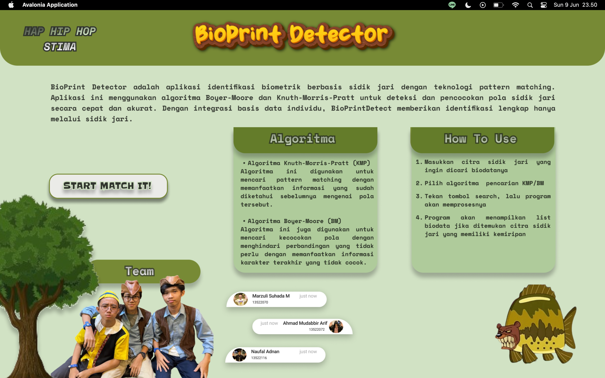

<!-- INTRO -->
<br />
<div align="center">
  <h1 align="center">Tugas Besar 3 IF2211 Strategi Algoritma Tahun Ajaran 2023/2024</h1>

  <p align="center">
    <h3> Pemanfaatan Pattern Matching dalam Membangun Sistem Deteksi Individu Berbasis Biometrik Melalui Citra Sidik Jari </h3>
    <p>Program made using C# Language</p>
    <br />
    <a href="https://github.com/zultopia/Tubes3_HapHipHop.git">Report Bug</a>
    ·
    <a href="https://github.com/zultopia/Tubes3_HapHipHop.git">Request Feature</a>
<br>
<br>

[![MIT License][license-shield]][license-url]

  </p>
</div>

<!-- CONTRIBUTOR -->
<div align="center" id="contributor">
  <strong>
    <h3>Dibuat oleh Kelompok "HapHipHop" :</h3>
    <table align="center">
      <tr>
        <td>NIM</td>
        <td>Nama</td>
      </tr>
      <tr>
        <td>Marzuli Suhada M</td>
        <td>13522070</td>
     </tr>
     <tr>
        <td>Ahmad Mudabbir Arif</td>
        <td>13522072</td>
    </tr>
     <tr>
        <td>Naufal Adnan</td>
        <td>13522116</td>
    </tr>
    </table>
  </strong>
</div>

## Table of Contents
1. [Deskripsi Program](#deskripsi-program)
2. [Bonus Enkripsi](#bonus-enkripsi)
3. [Bonus Video](#bonus-video) 
4. [Features](#features)
5. [Getting Started](#getting-started)
6. [How-to-Run](#how-to-run)
7. [Tampilan Program](#tampilan)

## Deskripsi Program

Program ini merupakan desktop app program yang dibuat dengan bahasa C#. Pada program ini, pengguna dapat memasukkan berkas citra berisi potongan gambar sidik jari. Nantinya akan dicari biodata dan sidik jari yang cocok dengan potongan gambar tersebut dengan memilih penggunaan algoritma antara Knuth Morris Prath dan Boyer Moore. Pencarian data yang cocok menggunakan pattern matching. Biodata pemilik sidik-jari bertujuan untuk mengetahui data informasi seperti yang tertera pada KTP. 
Dokumentasi lengkap tentang program dapat dilihat pada [link berikut](https://docs.google.com/document/d/1BHsjquNVL7-zK9WrRMB3IXFajNfWBN4aMshg5CqlR2Q/edit?usp=sharing)

### Algoritma KMP

Algoritma KMP (Knuth-Morris-Pratt) adalah algoritma pencocokan string yang efisien yang menggunakan informasi dari pola yang sedang dicocokkan untuk menghindari perbandingan ulang yang tidak perlu. Algoritma ini bekerja dengan terlebih dahulu membangun array Longest Prefix Suffix (LPS) untuk pola yang diberikan, yang menyimpan panjang prefix terpanjang yang juga merupakan suffix untuk setiap posisi dalam pola. Selama pencarian, ketika terjadi ketidakcocokan karakter antara teks dan pola, algoritma menggunakan nilai dalam array LPS untuk menentukan posisi baru dari indeks pola tanpa perlu membandingkan ulang karakter yang sudah dibandingkan sebelumnya. Dengan cara ini, algoritma dapat menggeser pola ke kanan dan melanjutkan pencocokan dengan jumlah perbandingan yang lebih sedikit, sehingga meningkatkan efisiensi pencarian dibandingkan dengan algoritma pencocokan string yang lebih sederhana.

### Algoritma BM

Algoritma Boyer-Moore (BM) adalah metode pencocokan string yang efisien yang memanfaatkan dua heuristik utama—karakter buruk (bad character) dan pencocokan yang baik (good suffix)—untuk menggeser pola lebih jauh di sepanjang teks saat terjadi ketidakcocokan, sehingga mengurangi jumlah perbandingan yang diperlukan. Implementasi ini dimulai dengan membangun tabel heuristik karakter buruk yang menyimpan posisi terakhir dari setiap karakter dalam pola. Selama pencarian, algoritma membandingkan pola dengan teks dari karakter terakhir pola, dan jika terjadi ketidakcocokan, menggunakan tabel karakter buruk untuk menentukan seberapa jauh pola harus digeser. Jika pola cocok sepenuhnya, posisi awal kemunculan pola dicatat, dan pola digeser untuk melanjutkan pencarian. Dengan memanfaatkan informasi dari tabel heuristik karakter buruk, algoritma ini mampu menghindari perbandingan yang tidak perlu dan secara signifikan meningkatkan efisiensi pencarian dibandingkan dengan metode pencocokan string yang lebih sederhana.

### Regex

Regex mengimplementasikan fungsi untuk melakukan transformasi teks "alay" ke dalam format aslinya dengan mengganti karakter khusus, menghapus karakter non-alfanumerik, mengubah singkatan menjadi bentuk lengkap, dan mengkapitalisasi kata-kata dengan benar. Selain itu, kode ini juga menyediakan fungsi untuk mencari kecocokan terbaik dari sebuah daftar berdasarkan tingkat kemiripan string menggunakan algoritma jarak Levenshtein. Dengan kombinasi fungsi-fungsi ini, kode memberikan kemampuan yang luas dalam pemrosesan dan analisis teks untuk keperluan pengubahan format, pembersihan, pengenalan kata, dan pencarian kecocokan string.
   
## Bonus Enkripsi
Dalam aplikasi program yang kami buat, kami melakukan enkripsi data pada tabel biodata. Enkripsi bertujuan untuk mengamankan informasi pribadi terkait orangnya. Enkripsi ini diimplementasikan menggunakan algoritma AES. Algoritma AES (Advanced Encryption Standard) adalah metode enkripsi blok simetrik yang digunakan untuk mengamankan data digital, bekerja dengan blok data 128 bit dan mendukung panjang kunci 128, 192, dan 256 bit. AES dikenal karena keamanan tinggi, kinerja cepat, fleksibilitas panjang kunci, dan penerimaan luas sebagai standar internasional, membuatnya andal dan efisien untuk berbagai aplikasi enkripsi data.

## Bonus Video
Kami juga membuat video sebagai media dalam memahami aplikasi program ini lebih lanjut. Untuk melihat videonya bisa meng-klik [HapHipHop](https://youtu.be/Huryu5GguwE?si=mNOTxMB90MjoDcfI) berikut. 

<a name="features"></a>
## Features
Berikut merupakan fitur dari program kami:
* Visualisasi aplikasi yang membuat menarik
* Gambar sidik-jari yang ingin dicocokan dan sidik jari yang cocok
* Toggle switch untuk memilih algoritma KMP atau BM
* Tampilan biodata dari sidik-jari yang cocok

<a name="getting started"></a>
## Getting Started!

Berikut merupakan cara untuk build project atau menginstall program

Clone repo menggunakan command berikut

```
git clone https://github.com/zultopia/Tubes3_HapHipHop.git 
```

## How-to-Run

Bagaimana cara menjalankan program? Gunakan command berikut pada folder program untuk menjalankan program utama

- Dari Root Folder lakukan perintah berikut
```
cd src
```
- Jalankan program dengan
```
dotnet run
```
Kami juga menyediakan build yang sudah dapat Anda gunakan langsung. Pada folder bin, terdapat executable zip untuk MACOS dan Windows. Unzip file yang sesuai dengan sistem operasi kamu, dan jalankan file hapHipHop! Setelah itu, ikuti petunjuk pada program. 

     
<a name="tampilan"></a>
## Tampilan Program



<!-- LICENSE -->
## Licensing

The code in this project is licensed under MIT license.  
Code dalam projek ini berada di bawah lisensi MIT.

<br>
<h3 align="center"> TERIMA KASIH! </h3>

<!-- MARKDOWN LINKS & IMAGES -->
<!-- https://www.markdownguide.org/basic-syntax/#reference-style-links -->
[license-shield]: https://img.shields.io/github/license/othneildrew/Best-README-Template.svg?style=for-the-badge
[license-url]: https://github.com/zultopia/Tubes3_HapHipHop/blob/main/LICENSE